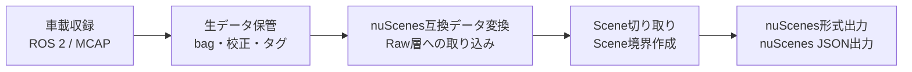
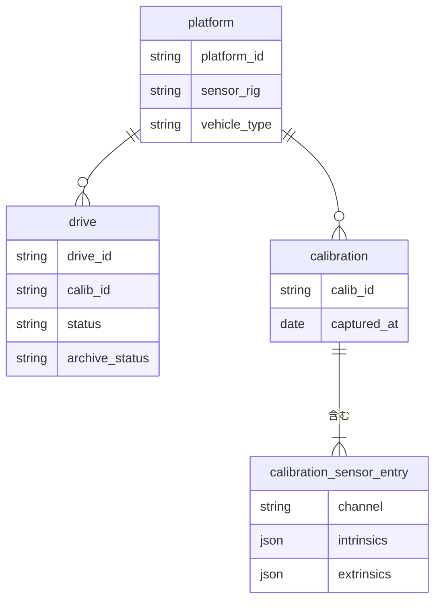

# CLAUDE.md — shasou-core
このファイルはClaude Code が shasou-core を実装・拡張する際の指針。設計判断の背景と「なぜそうなっているか」を集約する。**コードを書く前に必ず読むこと。**

## 0. shasou-core とは
shasou (車窓, *shasō*) エコシステムの共有スキーマ・規約パッケージ。実車/CARLAで収集したEnd-to-end自動運転向けデータをnuScenes形式へ変換する一連のツール群が、この1パッケージの契約を共有する。まずはshasouエコシステムの概要について解説する
### shasou eco system概要
shasouエコシステムは、以下のフローでEnd-to-end自動運転向けのデータ収集・キュレーションを実施



shasouエコシステムは、以下3リポジトリから構成される
- **shasou-recorder**: Jetson等で動作させ、車載収録を実施するツールキット (ROS 2 / MCAP)。想定している概要は`docs/recorder_summary.md`も参照
- **shasou-studio**: recorderで取得したデータをインポートして保管し、nuScenes互換データ変換、Scene切り取り、nuScenes形式出力等を実施するためのWebアプリ。データキュレーションのための分析機能も含む
- **shasou-core** (本リポジトリ): 上記 2 つが共有するmanifestスキーマ・MCAPトピック規約・trajectory成果物形式をPydantic + JSON Schemaで定義

#### データの階層構造
記録されるデータは以下の階層構造を持つ



- platform: 「学習データとして一体利用できる」ことを念頭に、センサ構成（sensor_rig）・車種（vehicle_type）が一致するデータをグルーピングしたもの。shasou-studioで定義を作成・管理し。recorderは同期時に取得（studio非依存のローカル定義でも動作可）
- drive: 1走行ごとに取得され、IDとしてdrive_idが割り当てられる。1つのdriveがnuScenes形式変換後のlogと1対1で対応。shasou-recorderが走行ごとに自動作成する
- calibration: キャリブレーション1回ごとに作成される（複数センサを含む）。1回のcalibrationはnuScenes形式変換時に複数センサ分のcalibrated_sensorレコードに展開される。shasou-recorderがキャリブレーションごとに自動作成する

#### データ収集のワークフロー
データ収集は以下の流れで実施
1. 設定のrecorderへの共有 ：shasou-studioで作成したplatform定義等の設定を、shasou-recorder側にダウンロード
2. 車上Jetson＋SSD（NVMe）で収録 ：shasou-recorderが実施
3. NAS：shasou-studioの直近数ヶ月程度のデータのストレージとして使用。書き込みはshasou-recorderが実施
4. S3：shasou-studioのアーカイブデータのストレージとして使用

各レコード（データの階層構造におけるdrive）はワークフローのどこにあるかをメタデータの`status`および`archive_status`で保持する。
- `status`は以下の状態から選ぶ
    - `recorded`：収録完了（車上SSDに存在）
    - `transferred`：NASへコピー完了（まだ検証前）
    - `verified`：チェックサム照合が通った（NAS上で健全性確認済み）
    - `imported`：shasou-studioがRaw層に取り込んだ
- `archive_status`は以下の状態から選ぶ
    - `none`：NASのみ
    - `archived`：S3標準
    - `glacier`：Glacier Deep Archive退避

## Directory Structure
shasou-coreは以下のディレクトリ構造を持つ。各ファイルの詳細は「3. ファイル別ガイド」で後述

```
shasou-core/
├── pyproject.toml              # 依存: pydantic v2のみ。extras: [io] pyarrow
├── README.md                   # スキーマ定義リポジトリに一般的に必要な内容を記述
├── CONTRIBUTING.md             # 「フレームワーク依存禁止」の規律を明文化
├── src/shasou_core/
│   ├── __init__.py
│   ├── version.py
│   ├── constants.py
│   ├── frames.py
│   ├── schemas/
│   │   ├── common.py
│   │   ├── platform.py
│   │   ├── manifest.py
│   │   ├── calibration.py
│   │   ├── topics.py
│   │   ├── events.py
│   │   ├── health.py
│   │   └── trajectory.py
│   ├── validation.py
│   └── io/                     # extra [io]
│       └── trajectory_io.py
├── jsonschema/v1/
├── scripts/export_jsonschema.py
└── tests/
    ├── test_*.py               # スキーマ単体 + 往復一致テスト
    └── fixtures/               # ★CARLAブリッジが実際に出力したmanifest等を実例フィクスチャとして格納
```

## 1. 絶対に守る規律

### 1.1 依存の規律 (最重要)
**ランタイム依存は pydantic のみ。** FastAPI / SQLAlchemy / ROS / numpy 等への
依存を `dependencies` に追加してはならない。理由: recorder は Jetson 上で動き、
Web アプリ都合の依存が混入すると車載側のビルドが汚れる。
- I/O 系 (pyarrow 等) は `[io]` のような optional extra に隔離する
- ROS 型はすべて**文字列**で表現する (`"sensor_msgs/msg/Image"`)。ROS への実依存は
  recorder の責務

### 1.2 スキーマ変更は SCHEMA_VERSION を伴う
`version.py` の `SCHEMA_VERSION` はデータ契約の SemVer。constants.py / manifest /
trajectory / topics 規約を変えたら上げる。manifest は書き込み時の版を記録し、
読み手は MAJOR 一致を要求する (`DriveManifest.is_schema_compatible`)。

### 1.3 生成物はコミットするが手で書かない
JSON Schema (`jsonschema/v1/`) は `model_json_schema()` からの生成物。CI で
「生成し直して差分ゼロ」を検証する。手編集しない。

---

## 2. 揺るがない設計思想 (エコシステム全体の憲法)

これらは過去の長い議論で確定した原則。実装判断で迷ったらここに立ち返る。

### 2.1 「正はソースに近い側」/ 非破壊・再生成可能
一次データ (MCAP) は不変。派生物 (nuScenes 出力、trajectory、events.jsonl) は
いつでも再生成できる。生値を焼き込まず、加工は下流の責務にする。
- 例: RADAR は生の相対動径速度のみ記録。自車運動補償 (vx_comp 相当) はエクスポータ
- 例: events.jsonl は bag からの派生物。正は bag 側
- 例: LiDAR は無補正のセンサフレームで記録。deskew は下流

### 2.2 token は切り出し前に確定し、以降不変
sample 等の token は Raw 層で採番し、Scene 切り出しが変わっても変えない。これに
より sample_annotation / instance 資産が切り出し変更に耐える。導出 token は
`derived_token()` (uuid5) で決定的に生成し、再エクスポートで安定させる。

### 2.3 内部表現は正規化、出力表現は互換優先
内部は正規化して持ち、nuScenes 出力時に互換のため複製・並び替えする。
- ego_pose は内部で正規化 (同時トリガならスイープ 1 ポーズ)、出力で sample_data
  ごとに複製 (nuScenes は ego_pose:sample_data = 1:1 を仮定)
- quaternion は内部 ROS 順 (xyzw)、nuScenes 出力で (wxyz) へ並び替え
- size は内部でフルサイズ+軸明示、nuScenes 出力で w,l,h 順へ

### 2.4 右手系のみ
shasou の世界に左手系 (CARLA/Unreal) は存在しない。CARLA ブリッジの境界で一度だけ
右手系へ変換し、以降は右手系。位置 `(x,-y,z)`、RPY `(roll,-pitch,-yaw)`、
舵角は左転舵正。変換は 1 モジュールに集約し散在させない。

### 2.5 チャネル集合の正は platform 定義
core は台数構成を固定しない。core が持つのは**命名規約** (`CAM_`/`LIDAR_`/`RADAR_`
プレフィックス + 大文字英数字)。実際のチャネル集合は platform.sensor_rig が正。
`NUSCENES_*_CHANNELS` は参考デフォルトであって上限ではない (6 台に限定しない)。

### 2.6 座標フレーム規約
- `base_link` = 後軸中心を路面高さへ投影した点 (nuScenes ego と同一)。空車時の
  静的高さで車体に剛結 (サス追従しない)
- センサフレーム = チャネル名小文字。カメラは `_optical` を追加 (Z前/X右/Y下)
- 画像トピックの frame_id は光学フレーム
- 動的 tf (map→base_link) は bag に記録しない。ego pose はトピック/trajectory で表現

---

## 3. ファイル別ガイド

### 実装済み (人間レビュー済み、勝手に変えない)
| ファイル | 役割 | 注意 |
|---|---|---|
| `version.py` | SCHEMA_VERSION と互換判定 | |
| `constants.py` | 単位規約・チャネル命名規約・時刻換算 | 「憲法」。変更は要 SCHEMA_VERSION |
| `frames.py` | tf tree・フレーム命名・静的 tf 期待値 | チャネル集合は引数で受ける (固定リスト持たない) |
| `schemas/common.py` | Token/時刻/Vector3/Quaternion/enum 群 | `EgoPoseBackend` はここが定義元 (共有語彙) |
| `schemas/topics.py` | MCAP トピック契約をデータとして定義 | RADAR=velocity_radial のみ必須。Depth は gt 配下 |
| `schemas/manifest.py` | DriveManifest | チャネルは命名規約のみ検証 (実在検証は validation) |
| `schemas/trajectory.py` | 軌跡成果物スキーマ | 選択肢 B: 1 drive 1 対多 backend |
| `io/trajectory_io.py` | Parquet 読み書き (extra) | pyarrow 依存はここだけ |
| `validation.py` | 横断検証 (manifest×platform×calib) | Issue リストを返す (例外投げない) |

### 骨格のみ (CLI で肉付けする)
| ファイル | 現状 | やること |
|---|---|---|
| `schemas/platform.py` | Platform/ChannelSpec/VehicleParams の骨格 | §4.1 参照 |
| `schemas/calibration.py` | CalibrationSet/SensorCalibEntry の骨格 | §4.2 参照 |

### 未実装 (CLI で新規作成)
| ファイル | やること |
|---|---|
| `schemas/events.py` | EventTag (events.jsonl 1 行)。§4.3 |
| `schemas/health.py` | TopicStats (topic_stats.json)。§4.4 |
| `scripts/export_jsonschema.py` | 全スキーマの JSON Schema 生成。§4.5 |
| `jsonschema/v1/*.json` | 上記の生成物 (コミット対象) |
| CI 設定 | pytest + JSON Schema 差分ゼロ検証。§4.6 |

---

## 4. CLI 実装タスク (TODO(cli))

### 4.1 platform.py の肉付け
`grep TODO(cli) src/shasou_core/schemas/platform.py` の箇所。
- **VehicleParams**: `steering_gear_ratio` (ハンドル角→実舵角)、`max_steer_angle_rad`
  (CARLA 正規化 steer→rad)、`speed_sign_rule`、`brake_normalization` (何を 1.0 と
  するか)、`base_link_offset` (車両モデル原点→後軸中心のオフセット Vector3)。
  これらは車両固有で、CARLA ブリッジ/CAN デコーダのアダプタが変換に使う
- **ChannelSpec**: 内部/外部パラメータの型参照、解像度、FOV 等。カメラは光学フレーム
  規約に従う
- 既存の `_modality_matches_name` バリデータ (名前と modality の矛盾を弾く) は壊さない

### 4.2 calibration.py の肉付け
- **CameraIntrinsics**: 焦点距離・主点・歪み係数。実車は歪みあり raw を前提、
  nuScenes 出力時に補正 (§2.3)
- **SensorExtrinsics**: base_link 基準の平行移動+回転。カメラは光学フレーム規約
- calibrated_sensor token は `derived_token(calib_id, channel)` で決定的生成 (§2.2)
- 1 CalibrationSet の各 entry が 1 calibrated_sensor に展開される (1:N)

### 4.3 events.py
EventTag: `timestamp` (ns)、`type` (固定語彙 enum: interesting/marker 等)、`label`
(語彙集)、`source` (driver_button/tablet/carla_scenario/auto_vlm 等)。人間起点タグ
(収録中) と自動タグ (収録後) が同フォーマットで共存し source で区別 (§2.1)。

### 4.4 health.py
TopicStats: トピックごとの Hz・ドロップ率・想定との差分。topic_stats.json の 1 レコード。

### 4.5 export_jsonschema.py
全トップレベルスキーマ (DriveManifest / TrajectoryMetadata / Platform /
CalibrationSet / EventTag / TopicStats) を `model_json_schema()` で
`jsonschema/v1/<name>.schema.json` へ出力。決定的な出力 (キー順ソート) にする。

### 4.6 validation.py の validate_observed_topics 拡張
現状は sensor_config 宣言トピックの存在確認のみ。`topics.contracts_for_source()`
と突き合わせ、source (carla/real) 別に gt 系・車両状態・基盤トピックの過不足も
検証する。CARLA なら gt/clock 必須、real ならそれらが無いこと、を確認。

### 4.7 テスト
新規スキーマごとに、単体検証 + JSON/YAML 往復一致テスト。既存 50 件は壊さない。
`ShasouModel` は `extra="forbid"` なので未知フィールド拒否もテストする。

---

## 5. トピック規約リファレンス (topics.py の要約)

実装の正は topics.py。実車移行時も同じ契約 (source 固有アダプタが吸収)。

### 共通センサ (実車・CARLA 両方)
- カメラ: `<ns>/cam_<pos>/image_raw/compressed` (CompressedImage/jpeg) +
  `camera_info`。frame_id=光学フレーム。image_transport 規約で末尾 `/compressed`
- LiDAR: `<ns>/<ch>/points` (PointCloud2, x/y/z/intensity/ring)。センサフレーム・無補正
- RADAR: 同上。必須 x/y/z/velocity_radial (接近負)。rcs/dynprop は optional
- IMU: orientation 無効 (covariance[0]=-1)。生センサ扱い
- GNSS: NavSatFix

### 車両状態 (共通、CAN 相当)
- `vehicle/drive_state`: AckermannDriveStamped。speed=m/s(後退負), steering_angle=
  rad(左正・前輪実舵角)
- `vehicle/pedals`: JointState。name=`("throttle_pedal","brake_pedal")` 固定、
  position=[0,1]
- `vehicle/reverse`, `vehicle/handbrake`: Bool

### CARLA 特権情報 (Ground Truth、gt 名前空間)
- `gt/ego_odom`: Odometry。pose=map, twist=base_link。trajectory の源泉
- `gt/objects`: 全アクター 3D BBox+actor_id+クラス。map 座標。実体は shasou_msgs
- `gt/agent_plan`: Path (PDM-Lite 計画軌跡)
- `gt/depth_<pos>/image`: 32FC1 メートル深度。RGB と光学フレーム共有。**実車に無い**
- `/clock`: sim 時刻

### 実車限定 (CLI で REAL_ONLY として追加想定)
GNSS 生観測 (PPK 用)、生 CAN (`can_msgs/Frame`)。DBC 再デコード可能に生も録る。

### CARLA 固有の変換注意
- LiDAR `rotation_frequency` = sim レート (20) に合わせる (1 tick 1 周)
- BBox extent は半寸法 → 2 倍。size 並びは w,l,h
- 全センサ 20Hz 同時トリガ = 同時トリガパターン。ego_pose は sample_data ごとに複製
- キーフレーム = 10 tick ごと (2Hz)

---

## 6. データ階層とワークフロー (recorder 側、参考)

```
platform (sensor_rig + vehicle_type 一致で「学習データとして一体利用可」)
 ├─ drive (1 走行 = nuScenes log と 1:1)
 └─ calibration (1 回 = 複数 calibrated_sensor に展開, 1:N)
```

manifest の `status`: recorded→transferred→verified→imported。recorder は
verified まで書き、imported は studio が catalog へ書き戻す。S3 退避は status と
別軸の `archive_status` (none/archived/glacier)。

platform 定義は studio が編集元、recorder は同期取得 (PlatformProvider 抽象:
LocalFileProvider でスタンドアロンも可)。使用した定義の版を manifest に刻む。

---

## 7. 開発コマンド

```bash
pip install -e ".[dev,io]"     # 開発セットアップ
pytest                          # 全テスト (現在 50 件)
python scripts/export_jsonschema.py   # JSON Schema 再生成 (実装後)
```

変更を入れたら: テストが通ること + JSON Schema 差分ゼロ + §1 の依存規律を確認。
