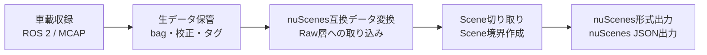
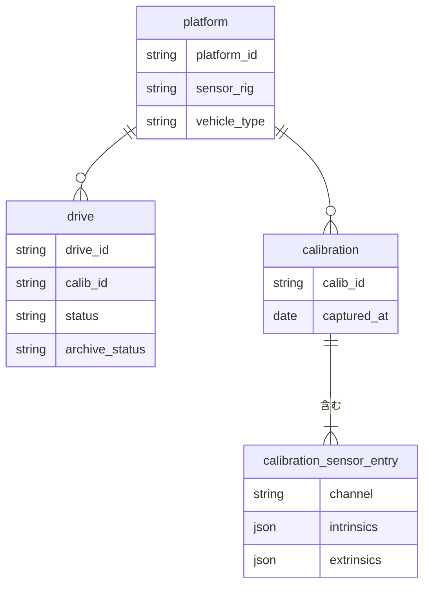

# shasou-core
shasouエコシステムの共有スキーマと規約を管理するリポジトリ

## Project Overview
### shasou eco system概要
shasouエコシステムは、以下のフローでEnd-to-end自動運転向けのデータ収集・キュレーションを実施



shasouエコシステムは、以下3リポジトリから構成される
- shasou-recorder: Jetson等で動作させ、車載収録を実施
- shasou-studio: recorderで取得したデータをインポートして保管し、nuScenes互換データ変換、Scene切り取り、nuScenes形式出力等を実施するためのWebアプリ。データキュレーションのための分析機能も含む
- shasou-core: 両者の共通仕様（manifestスキーマ・MCAPトピック規約・trajectory成果物形式）をPydantic + JSON Schemaで定義。

#### データの階層構造
記録されるデータは以下の階層構造を持つ



- platform: 「学習データとして一体利用できる」ことを念頭に、センサ構成（sensor_rig）・車種（vehicle_type）が一致するデータをグルーピングしたもの。shasou-studioで定義を作成・管理し。recorderは同期時に取得（studio非依存のローカル定義でも動作可）
- drive: 1走行ごとに取得され、IDとしてdrive_idが割り当てられる。1つのdriveがnuScenes形式変換後のlogと1対1で対応。shasou-recorderが走行ごとに自動作成する
- calibration: キャリブレーション1回ごとに作成される（複数センサを含む）。1回のcalibrationはnuScenes形式変換時に複数センサ分のcalibrated_sensorレコードに展開される。shasou-recorderがキャリブレーションごとに自動作成する

#### データ収集のワークフロー
データ収集は以下の流れで実施
1. 設定のrecorderへの共有 ：shasou-studioで作成したplatform定義等の設定を、shasou-recorder側にダウンロード
2. 車上Jetson＋SSD（NVMe）で収録 ：shasou-recorderが実施
3. NAS：shasou-studioの直近数ヶ月程度のデータのストレージとして使用。書き込みはshasou-recorderが実施
4. S3：shasou-studioのアーカイブデータのストレージとして使用

各レコード（データの階層構造におけるdrive）はワークフローのどこにあるかをメタデータの`status`および`archive_status`で保持する。
- `status`は以下の状態から選ぶ
    - `recorded`：収録完了（車上SSDに存在）
    - `transferred`：NASへコピー完了（まだ検証前）
    - `verified`：チェックサム照合が通った（NAS上で健全性確認済み）
    - `imported`：shasou-studioがRaw層に取り込んだ
- `archive_status`は以下の状態から選ぶ
    - `none`：NASのみ
    - `archived`：S3標準
    - `glacier`：Glacier Deep Archive退避

### shasou-recorderの概要
shasou-recorderの詳細は.mdを参照。ここではshasou-coreの定義において重要な事項を記載

### shasou-studioの概要
shasou-studioの詳細は.mdを参照。ここではshasou-coreの定義において重要な事項を記載

### shasou-core
shasou-coreは、shasou-recorderとshasou-studioに共通する仕様

- manifestにschema_versionを入れることで古い収録データを新しい変換器が読む際の互換性判定ができる

## Directory Structure
```
shasou-core/
├── pyproject.toml              # 依存: pydantic v2のみ。extras: [io] pyarrow
├── README.md
├── CONTRIBUTING.md             # 「フレームワーク依存禁止」の規律を明文化
├── src/shasou_core/
│   ├── __init__.py             # SCHEMA_VERSION・主要スキーマのre-export
│   ├── version.py              # SCHEMA_VERSION（SemVer）
│   ├── constants.py            # 正規チャネル名、単位規約（時刻=ns整数、角度=rad）
│   ├── frames.py               # ★constants から分離: tf tree定義（map/base_link/
│   │                           #   センサ/opticalフレーム、base_link原点=後軸中心・
│   │                           #   地面高さの定義、右手系規約の宣言）
│   ├── schemas/
│   │   ├── common.py           # Vector3, QuaternionXYZW, Token, Modality, 時刻型
│   │   ├── platform.py         # ★拡張: Platform, Vehicle, ChannelSpec に加え
│   │   │                       #   VehicleParams（ステアリングギア比、最大舵角、
│   │   │                       #   速度符号規則、ブレーキ正規化定義、
│   │   │                       #   base_linkオフセット）
│   │   ├── manifest.py         # ★拡張: DriveManifest に source (carla|real)、
│   │   │                       #   SimMetadata（マップ名・天候パラメータ）、
│   │   │                       #   ego_pose_backend、schema_version、status遷移
│   │   ├── calibration.py      # CalibrationSet, CameraIntrinsics（歪み係数込み）,
│   │   │                       #   SensorExtrinsics（光学フレーム規約を明記）
│   │   ├── topics.py           # ★大幅拡張（下記参照）
│   │   ├── events.py           # EventTag（events.jsonl の1行スキーマ）
│   │   ├── health.py           # TopicStats
│   │   └── trajectory.py      # TrajectoryMetadata（datum必須、backend id）、
│   │                           #   TrajectoryPoint、PoseQuality。carla_gt も
│   │                           #   バックエンドの一つとして列挙
│   ├── validation.py           # 横断検証: manifest⇔calib⇔platform の整合、
│   │                           #   platform不変条件（センサ構成一致）
│   └── io/                     # extra [io]
│       └── trajectory_io.py    # Parquet読み書き（列仕様はtrajectory.pyを参照）
├── jsonschema/v1/              # 生成JSON Schema（コミット対象、CIで差分ゼロ検証）
├── scripts/export_jsonschema.py
└── tests/
    ├── test_*.py               # スキーマ単体 + 往復一致テスト
    └── fixtures/               # ★CARLAブリッジが実際に出力したmanifest等を
                                #   実例フィクスチャとして格納
```

## 実装上の制約
- SQLAlchemy 2.xの `Session` は `Annotated` + `Depends` でDI
- 非同期（async/await）を使用する（ドライバ: asyncpg）
- CORSは開発時 `*` 許可、本番は環境変数で制御
- テストDBは別コンテナ（postgresのみ、PostGIS不要）ではなく同一イメージを使う
- NuScenesのデータパスは環境変数 NUSCENES_DATAROOT で渡す
- map expansionのレイヤー（drivable_area, lane等）はGeoJSON形式でフロントに渡す

## 行動原則
- 3ステップ以上のタスクは必ずPlanモードで開始する
- コードを読まずに書かない。必ず既存コードを確認してから変更する

## よくある実装ミスの禁止事項
- RouterにDB変換ロジックを書かない → app/service/ と app/converters/ に集約
- Pydanticモデルをmodels/と独立して定義しない → schemas/はmodels/から派生
- ジオメトリをWKBのままAPIレスポンスに含めない → 必ずGeoJSONに変換
- 新リソース追加時は endpoints/ + service/ + repository/ + schemas/ をセットで追加する
