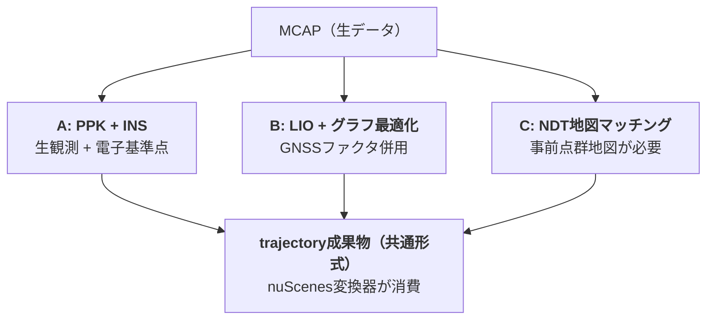

## 収集データの形式
### 収集ワークフローにおけるshasou-recorderの責務
- 車上: データ収録してSSDへ保存
- オフィス: NASへ転送 + チェックサム検証

### 収集データのフォルダ構成
shasou-recorderは以下のフォルダ構成でデータを収集

```
data/
├── platform_lincoln_6cam-lidar/       # platformごとにフォルダを分ける
|   ├── drives/
|   │   └── 2026-07-16_1030_vehicle01_osaka-umeda/   # drive_id
|   │       ├── manifest.yaml          # ドライブの自己記述メタデータ
|   │       ├── bags/
|   │       │   ├── segment_0000.mcap  # 分割収録（後述）
|   │       │   ├── segment_0001.mcap
|   │       │   └── checksums.sha256
|   │       ├── tags/
|   │       │   └── events.jsonl       # 収録中のイベントタグ（追記のみ）
|   │       ├── health/
|   │       │   └── topic_stats.json   # Hz・ドロップ率・ディスクログ
|   │       └── notes.md               # 同乗者の自由記述（任意）
|   └── vehicles/
|       ├── vehicle01/
|       |   └── calibrations/
|       |       ├── calib_v003_2026-07-01/ # キャリブレーション実施ごとに1フォルダ
|       |       │   ├── intrinsics/        # カメラ内部パラメータ
|       |       │   ├── extrinsics/        # センサ間外部パラメータ
|       |       │   └── report.pdf         # キャリブ品質レポート
|       |       └── ...
|       ├── vehicle02/
|       :   └── calibrations/
|               ├── calib_v003_2026-07-01/
|               └── ...
├── platform_lincoln_7cam-lidar/
:
├── vehicle_types/
|   └── lincoln_mkz.yaml
└── catalog.sqlite                 # 全ドライブの索引
```

### 各収集データの内容
#### manifest.yamlの中身
nuScenesのlogテーブル等に必要な情報を保持（将来的にはCosmos Reason等による自動タグ付けも想定）する。

```yaml
drive_id: 2026-07-16_1030_vehicle01_osaka-umeda
uuid: 7f3a...
source: real                   # real / carla（現状の対応ソース）
schema_version: 0.3.0          # shasou-coreの互換性判定に使用
platform: platform_lincoln_6cam-lidar
vehicle: vehicle01
ego_pose_backend: ppk-ins      # 自己位置推定（carlaソースではcarla-gt）
calib_id: calib_v003_2026-07-01
date_captured: "2026-07-16"
location: osaka-umeda          # → nuScenes変換後のlog.locationとなる
driver: tanaka
weather: rain                  # → nuScenes変換後のscene.descriptionの素材となる
recorder_version: v1.2.0       # 収録ソフトのバージョン
sensor_config:                 # 正規チャネル名 ⇔ 実トピック名の対応（実センサのみ）
  LIDAR_TOP: /sensing/lidar_top/points
  RADAR_FRONT: /sensing/radar_front/points
  CAM_FRONT: /sensing/cam_front/image_raw/compressed
  ...
status: verified               # recorded → transferred → verified → imported
archive_status: none           # none / archived / glacier（statusとは独立の軸）
```

※ statusのimportedはshasou-studioがRaw層取り込み時に書き戻す。recorderが自力で書くのはverifiedまで。carlaソースの場合はsensor_configの実センサに加え、gt系トピック（gt/ego_odom, gt/objects, gt/depth_* 等）が別途存在する。

#### catalog.sqlite
検索高速化のため、manifestと同内容をcatalog.sqlite（データベース）に記録しておく。

#### event.jsonl
運転中にユーザーが各種端末（物理/ステアリングボタンやタブレット）から入力した情報をROS 2 Topicとして受け取り、JSONL形式で保存する（スキーマはshasou-coreのEventTagで定義）。収録中の人間起点タグと収録後の自動タグ（carla_scenario等）が同フォーマットで共存し、sourceで区別する。events.jsonlはbagからの派生物（正はbag側）。

```jsonl
{"timestamp": 1752641234512000000, "type": "interesting", "label": "cut-in", "source": "driver_button"}
{"timestamp": 1752641301220000000, "type": "marker", "label": "construction zone", "source": "tablet"}
```

**timestampはエポックからのナノ秒整数**（shasou全体の時刻規約。float秒は不可）。

#### ego_pose_backendの選択肢
メタデータの`ego_pose_backend`に記録する自己位置推定の方法は、以下から選択する


